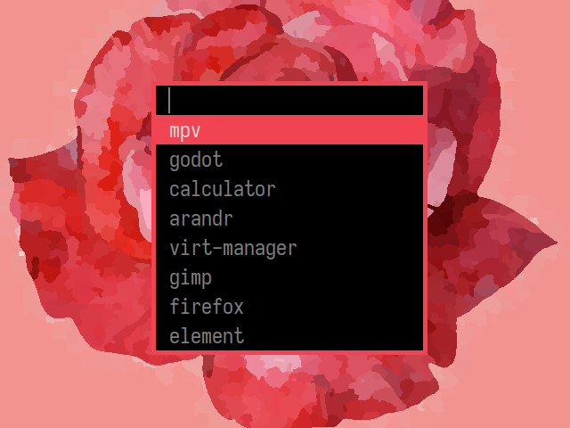

# dprint

Print specified values from desktop files to stdout.

## Usage

`dprint [-v] [-d path] [-i key:val] [-o key]`

Any input value can be replaced with `-` to use the value from stdin instead.

## Building

Install the dependencies:

- go (>=1.12)
- scdoc

Then compile dprint:

    $ make

## Installation

    # make install

## Screenshot

## License

GPL3 - See License for details.

Copyright 2019 Dakota Walsh

## Resources

dprint uses a public mailing list for contributions and discussion. You can
browse the list [here](https://lists.sr.ht/~kota/public-inbox) and [email
patches](https://git-send-email.io) or questions to
[~kota/public-inbox@lists.sr.ht](https://lists.sr.ht/~kota/public-inbox).

If you're reporting an bug/feature request our issue tracker is here:
[~kota/dprint](https://todo.sr.ht/~kota/dprint)
